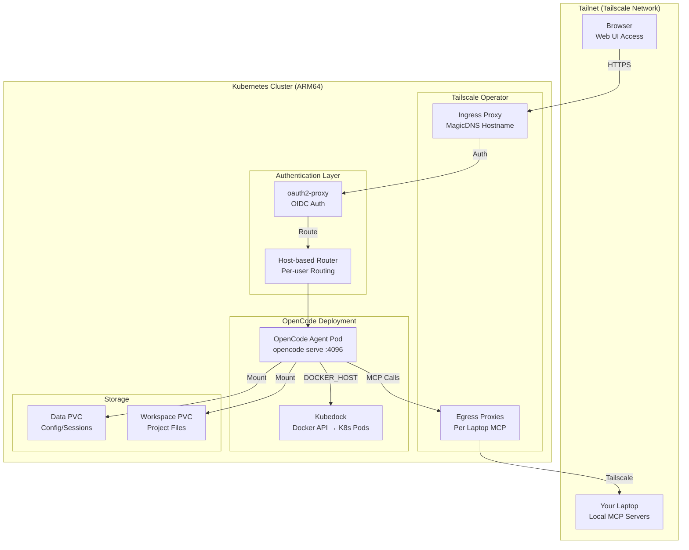
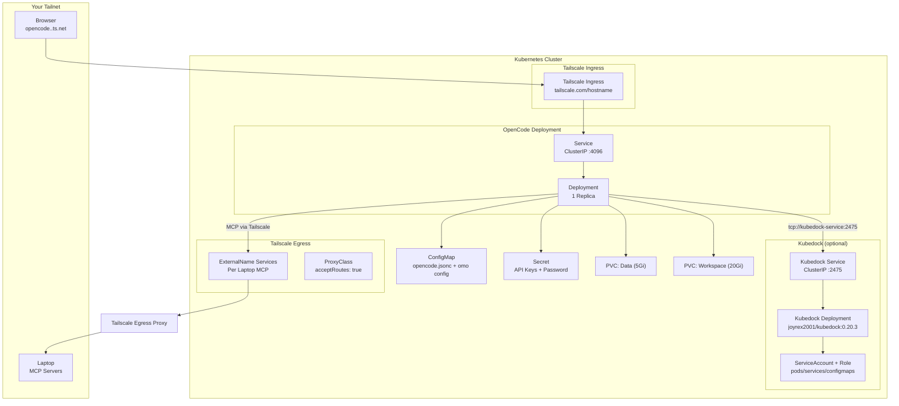
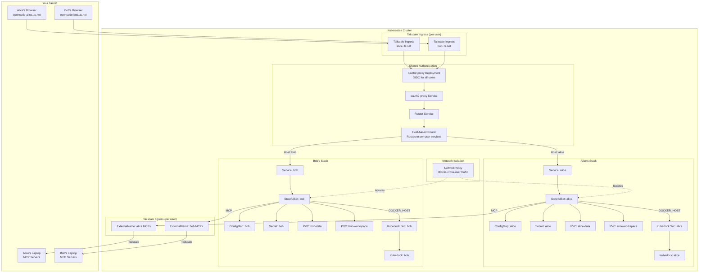
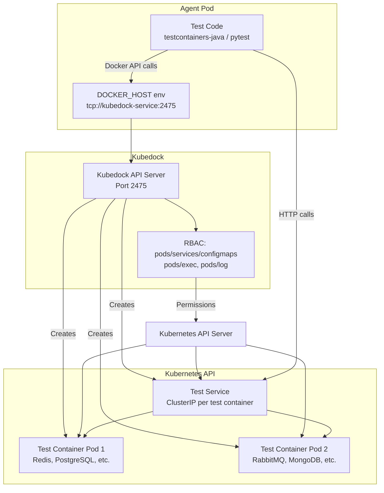
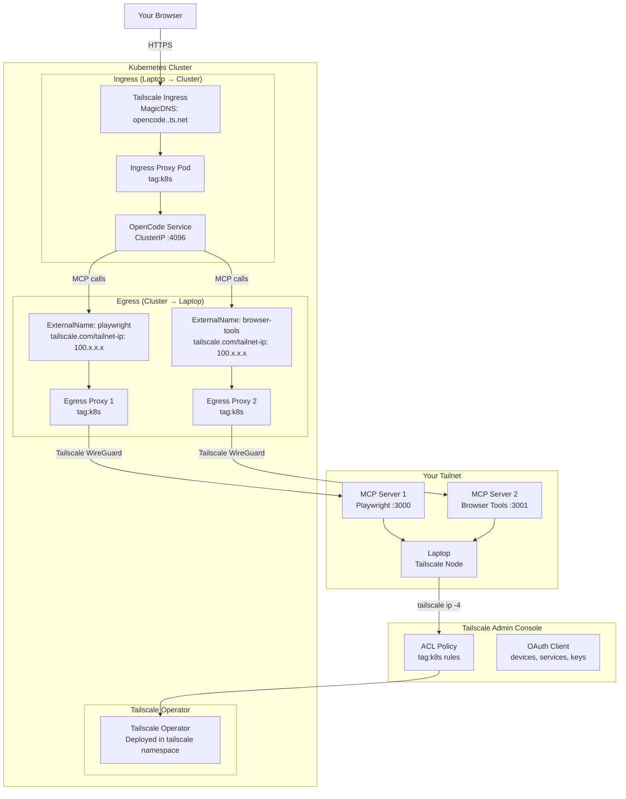
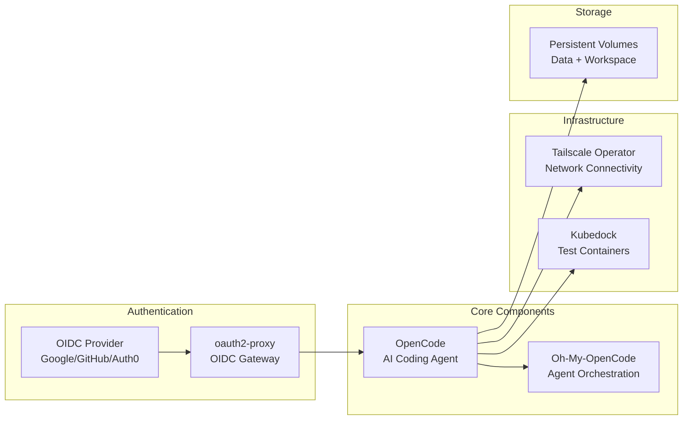
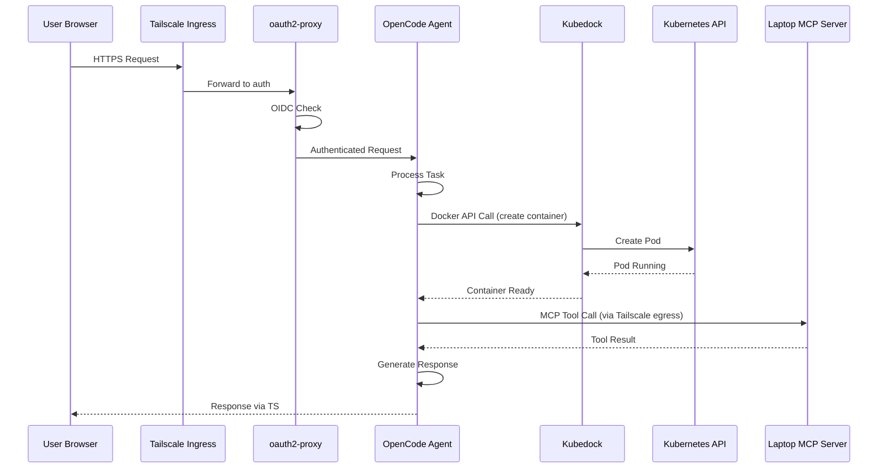
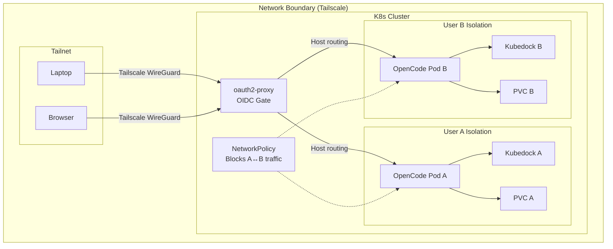
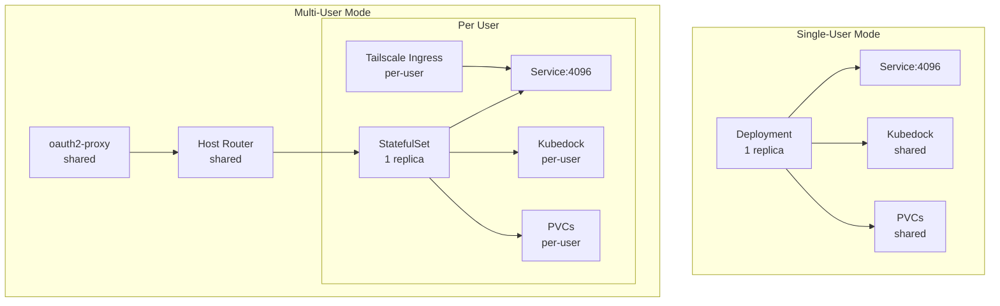

# K8s-OpenCode Architecture Design

OpenCode + Oh-My-OpenCode on Kubernetes with Tailscale connectivity and Kubedock test container support.

The chart and container images are published to GitHub Container Registry (GHCR):

- **Chart**: `oci://ghcr.io/timothyclin/k8s-opencode/chart/ok8s/ok8s`
- **Workspace image**: `ghcr.io/timothyclin/k8s-opencode/opencode-workspace`
- **Auth router image**: `ghcr.io/timothyclin/k8s-opencode/auth-router`

See [Quick Start](../README.md#quick-start) for installation instructions.

---

## System Overview

This diagram shows the complete end-to-end architecture at a glance. Two independent connectivity paths run through a single Tailscale tailnet:

1. **Ingress path** (top-down): Your browser reaches the OpenCode web UI by connecting to a Tailscale MagicDNS hostname. The Tailscale operator provisions an ingress proxy pod inside the cluster that terminates the WireGuard tunnel and forwards traffic through an oauth2-proxy authentication layer before reaching the OpenCode agent.

2. **Egress path** (bottom-up): The OpenCode agent calls MCP (Model Context Protocol) servers running on your laptop. Each laptop MCP is exposed to the cluster as an ExternalName Service backed by a Tailscale egress proxy pod. The agent never talks to your laptop directly — it uses standard Kubernetes DNS names that the operator resolves over the WireGuard mesh.

3. **Kubedock path** (internal): When enabled, the agent's `DOCKER_HOST` environment variable points to a kubedock service inside the cluster. Instead of spawning Docker containers locally (which would OOM-kill the agent pod), kubedock translates each Docker API call into a native Kubernetes Pod creation.

4. **Storage**: Two PersistentVolumeClaims back the agent — one for ephemeral config and session data, one for the persistent workspace where project files live.



---

## Single-User Mode

Single-user mode is the default and simplest deployment. A standard Kubernetes `Deployment` with one replica runs the OpenCode agent. There is no authentication proxy — the `serverPassword` value protects the HTTP endpoint directly.

**Ingress path**: The Tailscale Ingress resource carries the annotation `tailscale.com/hostname`, which tells the operator to create a proxy pod and assign it a MagicDNS hostname like `opencode.<tailnet>.ts.net`. The proxy terminates TLS automatically and forwards plain HTTP to the OpenCode Service on port 4096.

**Egress path**: Each entry in `mcp.laptopServers[]` creates an ExternalName Service annotated with either `tailscale.com/tailnet-ip` or `tailscale.com/tailnet-fqdn`. The Tailscale operator watches these annotations and provisions a dedicated egress proxy pod per laptop MCP. The agent resolves the ExternalName DNS name and the proxy forwards the TCP connection over WireGuard to your laptop.

**Kubedock**: When `kubedock.enabled: true`, a single shared kubedock Deployment runs in the same namespace. It uses a ServiceAccount bound to a Role granting `pods`, `services`, `configmaps`, `pods/exec`, and `pods/log` permissions — the minimum set needed to translate Docker API calls into Pod lifecycle operations. The agent's `DOCKER_HOST` env var is set to `tcp://<release>-kubedock-service:2475`.

**Storage**: Two PVCs are created at install time — `data` for OpenCode's internal config and session state (default 5Gi), and `workspace` for project files (default 20Gi). Both are mounted into the agent pod at `/root/.local/share/opencode` and `/workspace` respectively.



---

## Multi-User Mode

Multi-user mode replaces the single Deployment with a per-user StatefulSet — one replica per user, each fully isolated. The key design challenge is routing: all users share a single oauth2-proxy deployment (CNCF, MIT-licensed) for OIDC authentication, and a lightweight host-based router sits behind it to dispatch requests to the correct user's service.

**Authentication flow**: Each user gets their own Tailscale Ingress with a unique MagicDNS hostname (e.g., `opencode-alice.<tailnet>.ts.net`). The ingress proxy forwards to the shared oauth2-proxy, which validates the OIDC session. Behind oauth2-proxy, a host-based router inspects the `Host` header and routes to the matching user's Service. This means only one oauth2-proxy deployment runs regardless of user count — it's a shared infrastructure component, not a per-user one.

**Per-user isolation**: Each user in `values.yaml` gets their own StatefulSet, ConfigMap, Secret, two PVCs, Tailscale Ingress, and (optionally) kubedock Deployment. The StatefulSet's pod ordinal maps to the user's position in the `users` list — this is how the entrypoint script selects the correct per-user config at startup.

**NetworkPolicy**: A single NetworkPolicy blocks cross-user pod-to-pod traffic. User A's test containers (spawned by kubedock) cannot reach User B's agent pod, and vice versa. The policy allows DNS, kubedock API access within the same user's label scope, and egress to the Tailscale proxy pods.

**Kubedock per-user**: In multi-user mode, each user gets their own kubedock Deployment and Service, labeled with `app.kubernetes.io/user: <name>`. The `--labels` flag tells kubedock to tag all spawned test pods with the user's label, which the NetworkPolicy uses to enforce isolation. The agent's `DOCKER_HOST` points to `tcp://<release>-kubedock-<username>:2475`.

**Tailscale egress per-user**: Each user can define their own `laptopServers` list under their user entry. The chart creates per-user ExternalName Services named `<release>-egress-<username>-<mcp-name>`, each spawning its own egress proxy pod.



---

## Kubedock Architecture

Kubedock (`joyrex2001/kubedock:0.20.3`) solves a specific problem: test frameworks like Testcontainers (Java), pytest-testcontainers (Python), or go-testcontainers expect a Docker daemon at `DOCKER_HOST`. Running an actual Docker daemon inside a Kubernetes pod (DinD) is resource-heavy and prone to OOM kills. Kubedock instead implements a subset of the Docker HTTP API and translates each call into Kubernetes resources.

**How it works**: Your test code makes a `POST /containers/create` call to `tcp://kubedock-service:2475`. Kubedock receives this, creates a Kubernetes Pod with the same image, ports, and environment variables, then returns a container ID that maps to the Pod name. Subsequent API calls (`start`, `stop`, `logs`) are translated to equivalent `kubectl`-style operations against the Pod.

**RBAC**: Kubedock needs permissions to create and manage Pods, Services, and ConfigMaps in its namespace, plus `pods/exec` for attaching to running containers and `pods/log` for streaming logs back to the test framework. The chart creates a dedicated Role and RoleBinding scoped to the release namespace — kubedock cannot touch resources outside its own namespace.

**Test container networking**: When kubedock creates a test Pod (e.g., PostgreSQL), it also creates a ClusterIP Service so the test code can reach it. The test framework discovers this service via the container ID returned from the create call. Your test code then makes HTTP/TCP calls to that service — the same way it would talk to a real Docker container.

**Multi-user isolation**: In multi-user mode, kubedock runs the `--labels` flag to tag all spawned pods with `app.kubernetes.io/user: <username>`. Combined with the NetworkPolicy, this ensures User A's test containers cannot communicate with User B's agent pod or test containers.



---

## Tailscale Connectivity

This diagram details the two-way connectivity model that makes the entire deployment work without any public internet exposure, ingress controllers, or TLS certificate management.

**Prerequisites**: The Tailscale Kubernetes operator must be installed in its own `tailscale` namespace before deploying this chart. It requires an OAuth client from the Tailscale admin console with `devices`, `services`, and `keys` scopes. The operator uses this OAuth client to authenticate its own API calls to the Tailscale control plane.

**Ingress (Laptop → Cluster)**: When `ingress.enabled: true`, the chart creates a Kubernetes Ingress resource with `ingressClassName: tailscale`. The operator watches for this resource and provisions a proxy pod tagged with `tag:k8s` (configurable via `tailscaleOperator.proxyTag`). The annotation `tailscale.com/hostname` assigns a MagicDNS name. The proxy pod handles TLS termination automatically using Tailscale's built-in HTTPS — no cert-manager or Let's Encrypt needed.

**Egress (Cluster → Laptop)**: Each laptop MCP server is defined in `mcp.laptopServers[]`. The chart creates an ExternalName Service for each one, annotated with either `tailscale.com/tailnet-ip` or `tailscale.com/tailnet-fqdn`. The operator watches these annotations and provisions a separate egress proxy pod per service. The proxy pod joins your tailnet, establishes a WireGuard tunnel to the target laptop, and forwards TCP connections. From the agent pod's perspective, it's just talking to a regular Kubernetes Service DNS name — the WireGuard tunneling is completely transparent.

**ProxyClass**: The `ProxyClass` resource with `acceptRoutes: true` tells egress proxy pods to accept advertised routes from your laptop. This is needed when your laptop MCP server is behind a Tailscale subnet router (e.g., your laptop advertises its entire local network).

**ACL policies**: The `tag:k8s` tag applied to all proxy pods must be allowed in your Tailscale ACL policy to communicate with your laptop nodes. The ACL also controls which tailnet devices can reach the OpenCode UI.



---

## Component Relationships

This diagram shows the dependency graph between the four architectural layers. OpenCode is the central component — everything else exists to support it.

**Core layer**: OpenCode is the AI coding agent itself — the `opencode serve` process listening on port 4096. Oh-My-OpenCode runs as a plugin inside OpenCode, providing the multi-agent orchestration layer (Sisyphus task runner, Oracle/Librarian/Explore agents, category-based model routing). Without Oh-My-OpenCode, OpenCode still functions as a standalone agent.

**Infrastructure layer**: Tailscale provides all external network connectivity — without it, neither the web UI nor laptop MCP servers are reachable. Kubedock is optional — the agent works without it, but test containers would need to run as DinD sidecars (resource-heavy, OOM-prone).

**Authentication layer**: In single-user mode, this layer is bypassed — the `serverPassword` protects the endpoint directly. In multi-user mode, an external OIDC provider (Google, GitHub, Auth0, etc.) authenticates users through oauth2-proxy, which acts as the gatekeeper for all inbound traffic.

**Storage layer**: Persistent volumes are the only stateful component. If the agent pod is deleted and recreated, the PVCs ensure config, sessions, and workspace files survive. The `data` PVC stores OpenCode's internal state (auth tokens, MCP credentials, session history). The `workspace` PVC stores the user's project files.



---

## Data Flow: Agent Session

This sequence diagram traces a complete user request from browser to response, showing how all components interact during a typical coding session that involves both test container creation and laptop MCP calls.

1. **Authentication**: The user's HTTPS request hits the Tailscale ingress proxy, which forwards it to oauth2-proxy. If the OIDC session cookie is valid, the request passes through. If not, the user is redirected to the OIDC provider's login page.

2. **Task processing**: OpenCode receives the authenticated request and begins processing. This may involve reading workspace files, consulting the Oh-My-OpenCode agent orchestration layer, or delegating subtasks to specialized agents (Oracle for architecture, Librarian for research, etc.).

3. **Test container creation**: If the task requires running tests that use Testcontainers, the agent's test framework makes Docker API calls to `DOCKER_HOST` (pointing to kubedock). Kubedock translates each call into Kubernetes Pod operations — creating the container, starting it, and waiting for readiness. The test framework then runs its tests against the spawned pods.

4. **MCP tool calls**: If the task requires tools provided by a laptop MCP server (e.g., Playwright for browser automation), the agent makes an HTTP call to the ExternalName Service DNS name. The Tailscale egress proxy intercepts this, forwards it over WireGuard to the laptop, and returns the result.

5. **Response**: After all tool calls complete and the agent generates its response, it streams the result back through the Tailscale ingress proxy to the user's browser.



---

## File Structure

```
chart/
├── Chart.yaml                          # Chart metadata
├── values.yaml                         # All configurable values
├── templates/
│   ├── _helpers.tpl                    # Named templates (config generation)
│   ├── namespace.yaml                  # Namespace creation
│   ├── deployment.yaml                 # Single-user Deployment
│   ├── statefulset.yaml                # Multi-user StatefulSets (per user)
│   ├── service.yaml                    # ClusterIP :4096
│   ├── configmap.yaml                  # Single-user: opencode.jsonc + omo config
│   ├── user-configmap.yaml             # Multi-user: per-user ConfigMaps
│   ├── user-secret.yaml                # Multi-user: per-user Secrets
│   ├── user-ingress.yaml               # Multi-user: per-user Tailscale ingress
│   ├── resourcequota.yaml              # Multi-user: namespace resource quota
│   ├── identity-configmap.yaml         # Identity files (AGENTS.md, etc.)
│   ├── pvc.yaml                        # Single-user: Data + workspace PVCs
│   ├── secrets/
│   │   ├── plain-secrets.yaml          # Standard K8s secrets
│   │   ├── sealed-secrets.yaml         # Bitnami sealed-secrets (conditional)
│   │   └── external-secrets.yaml       # external-secrets-operator (conditional)
│   ├── ingress/
│   │   └── tailscale-ingress.yaml      # Tailscale Ingress (conditional)
│   ├── kubedock/
│   │   ├── serviceaccount.yaml         # Kubedock service account
│   │   ├── role.yaml                   # RBAC role (pods, services, configmaps)
│   │   ├── rolebinding.yaml            # Role binding
│   │   ├── deployment.yaml             # Single-user kubedock Deployment
│   │   ├── service.yaml                # Single-user kubedock Service
│   │   ├── user-deployment.yaml        # Multi-user per-user kubedock Deployments
│   │   ├── user-service.yaml           # Multi-user per-user kubedock Services
│   │   └── networkpolicy.yaml          # NetworkPolicy for user isolation
│   ├── tailscale/
│   │   ├── proxyclass.yaml             # ProxyClass (acceptRoutes: true)
│   │   └── egress-services.yaml        # ExternalName Services per laptop MCP
│   ├── oauth2-proxy/
│   │   ├── configmap.yaml              # oauth2-proxy configuration
│   │   ├── deployment.yaml             # oauth2-proxy deployment
│   │   ├── service.yaml                # oauth2-proxy service
│   │   ├── router-configmap.yaml       # Host-based router config
│   │   ├── router-deployment.yaml      # Host-based router deployment
│   │   └── router-service.yaml         # Host-based router service
│   └── tests/
│       └── connection-test.yaml        # helm test
```

---

## Configuration Matrix

| Feature | Single-User | Multi-User |
|---------|-------------|------------|
| **Workload** | Deployment (1 replica) | StatefulSet (1 replica per user) |
| **Auth** | serverPassword | oauth2-proxy + per-user passwords |
| **Config** | Shared ConfigMap | Per-user ConfigMap |
| **Secrets** | Shared Secret | Per-user Secret |
| **Storage** | Shared PVCs | Per-user PVCs |
| **Ingress** | Single Tailscale Ingress | Per-user Tailscale Ingress |
| **Kubedock** | Shared Deployment | Per-user Deployment + NetworkPolicy |
| **Tailscale Egress** | Shared ExternalName Services | Per-user ExternalName Services |

---

## Security Boundaries

This diagram illustrates the layered security model that protects each user's data and workload in multi-user deployments.

**Network boundary (Tailscale)**: The entire cluster is invisible to the public internet. All inbound and outbound traffic flows through WireGuard tunnels managed by the Tailscale operator. Only devices on your tailnet can reach the OpenCode UI or serve as MCP endpoints.

**Authentication boundary (oauth2-proxy)**: In multi-user mode, every request must pass through oauth2-proxy's OIDC validation. Even if someone discovers a user's MagicDNS hostname, they cannot access the agent without valid OIDC credentials. The host-based router behind oauth2-proxy adds a second layer — it only routes to services whose hostname matches a known user.

**Per-user isolation**: Each user runs in their own logical boundary:
- **Pod isolation**: User A's agent pod cannot reach User B's agent pod (enforced by NetworkPolicy)
- **Storage isolation**: User A's PVCs are mounted only into User A's StatefulSet
- **Config isolation**: User A's ConfigMap and Secret contain only User A's API keys and settings
- **Kubedock isolation**: User A's test containers are labeled with `user: alice` and can only communicate with User A's agent pod

**Cross-user traffic**: The NetworkPolicy explicitly blocks pod-to-pod traffic between different users' stacks. It allows DNS resolution (required for all pods), kubedock API access within the same user's label scope, and egress to Tailscale proxy pods. Any other traffic is denied by default.



---

## Deployment Modes Comparison

This diagram contrasts the two deployment modes side by side to clarify when to use each.

**Single-user mode** is the default and recommended starting point. A single `Deployment` with one replica runs the OpenCode agent. Authentication is handled by the `serverPassword` value — a simple HTTP password check. All resources (kubedock, PVCs, ConfigMaps) are shared within this single instance. Use this when you're the only user, or when you want the simplest possible deployment.

**Multi-user mode** activates when `mode: "multi"` is set and at least one user is defined in the `users` list. The architecture shifts significantly:
- Each user gets their own `StatefulSet` (not a Deployment — StatefulSets provide stable pod identity and ordered lifecycle, which the entrypoint script uses to select per-user config)
- Authentication moves from `serverPassword` to a shared oauth2-proxy deployment handling OIDC for all users
- A host-based router sits behind oauth2-proxy to dispatch requests to the correct user's service based on the `Host` header
- All resources multiply per user: kubedock Deployments, PVCs, ConfigMaps, Secrets, Tailscale Ingress resources
- A NetworkPolicy enforces network-level isolation between users

**When to switch**: Start with single-user mode. Switch to multi-user when you need to share a cluster with teammates while maintaining per-user isolation of API keys, workspace files, and session data. The chart supports both modes in the same codebase — switching is a `values.yaml` change plus a `helm upgrade`.


