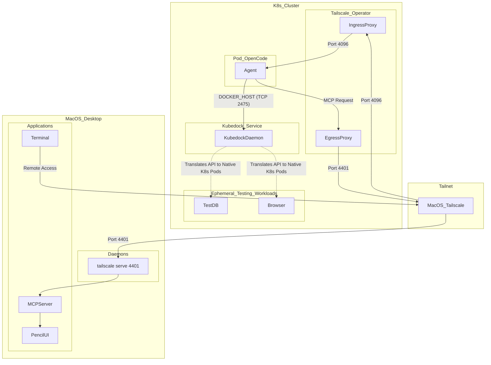

# **Distributed Autonomous Agent Architecture: Orchestrating OpenCode, Pencil.dev, and Remote Execution via Tailscale Overlay Networks**

## **1\. Executive Summary and Architectural Paradigm**

The integration of advanced Large Language Model (LLM) autonomous agents into
modern software development workflows presents unprecedented challenges in
infrastructure design, resource allocation, and network topography. The
deployment of the opencode agent, augmented with the oh-my-openagent
orchestration framework, represents the bleeding edge of autonomous coding
capability.1 However, embedding these sophisticated agents within a remote
Kubernetes (K8s) cluster while maintaining real-time synchronization with a
local macOS desktop presents a complex distributed systems problem.

This exhaustive research report details the systemic integration of these
heterogeneous environments based on a highly decoupled architecture. The primary
objective is to host the opencode reasoning engine and all containerized test
executions (unit tests via Testcontainers, UI testing via Playwright, and E2E
integration tests via Docker Compose) within the Kubernetes cluster. To prevent
the severe Out-Of-Memory (OOM) failures associated with sidecar patterns 4, the
Docker execution environment is managed on-demand via Kubedock, an API
translation layer that dynamically provisions ephemeral Pods for containerized
workloads.

Simultaneously, the macOS desktop serves purely as a remote human interface and
design nexus. The developer accesses the remote agent using the opencode attach
CLI command over a secure Tailscale WireGuard mesh network 6, while the agent
securely reaches back to the macOS desktop to interact with the local pencil.dev
User Interface via the Model Context Protocol (MCP).7 By utilizing the Tailscale
Kubernetes Operator for bidirectional routing (Ingress for human access, Egress
for MCP access) 8, this architecture achieves a zero-trust, highly performant,
and memory-efficient developer environment.

## **2\. The Resource Constraint Conundrum: Decoupling Docker via On-Demand Orchestration**

In conventional Kubernetes Continuous Integration and Continuous Deployment
(CI/CD) architectures, it is common practice to attach a Docker-in-Docker (DinD)
sidecar container directly to a worker pod to facilitate container image builds
and test execution. However, when deploying autonomous AI agents such as
opencode, this architectural pattern introduces severe systemic fragilities and
performance bottlenecks.4

### **2.1 The Memory Pressure Dynamics of LLM Agents**

The opencode executable and its overarching orchestrator framework,
oh-my-openagent, are designed to maintain extensive conversational context
windows, parse immense codebases, index abstract syntax trees, and hold
historical interaction data in memory.2 The underlying JavaScript runtimes
allocate significant heap space to serialize and deserialize massive JSON
payloads intended for upstream LLM APIs such as Anthropic's Claude, OpenAI's GPT
models, or Google's Gemini.10

As the agent explores a repository, generates code, and formulates execution
plans, the memory footprint of the runtime environment expands rapidly. When a
DinD sidecar is introduced into the exact same Kubernetes Pod namespace, the
memory limits configured for the Pod via the Linux cgroups mechanism are rapidly
consumed. The Docker daemon itself requires substantial memory for image layer
caching, concurrent container execution management, and overlay filesystem
operations.11

### **2.2 The Cumulative Impact of Containerized Testing Workloads**

The memory pressure is exacerbated exponentially when the agent attempts to
execute comprehensive test suites. Modern testing paradigms rely heavily on
containerization to ensure environmental consistency. Testcontainers deploys
ephemeral databases and a mandatory utility container known as Ryuk.12
Playwright UI testing launches headless browser binaries (Chromium, Firefox,
WebKit) consuming significant RAM for rendering engines.13 E2E testing utilizes
Docker Compose to orchestrate entire microservices stacks.15

### **2.3 The Solution: On-Demand Container Orchestration via Kubedock**

Under the Linux cgroups v2 heuristic, when a Pod's aggregate memory consumption
exceeds its defined limit, the kernel invokes the Out-Of-Memory (OOM) killer.
Because the LLM agent process often exhibits rapid, unpredictable memory
allocation spikes during response generation, it is highly susceptible to being
targeted and terminated by the kernel, irrevocably destroying its conversational
state.

To permanently mitigate this catastrophic failure mode without moving execution
off-cluster or relying on heavy, persistent DinD pods, the architecture
leverages **Kubedock**. Kubedock is a minimal implementation of the Docker API
that orchestrates containers directly on a Kubernetes cluster rather than
running containers locally.

Instead of spawning containers inside a Docker daemon, Kubedock intercepts the
agent's Docker API requests and dynamically translates them into Kubernetes Pod
creations. When the agent completes its test execution, the ephemeral pods are
automatically deleted. This completely segregates reasoning from execution at
the cluster scheduling level.

| Execution Strategy            | Memory Overhead in Agent Pod | Risk of OOM Kill | Architectural Suitability for Agents |
| :---------------------------- | :--------------------------- | :--------------- | :----------------------------------- |
| **DinD Sidecar**              | Extremely High               | Critical         | Unsuitable (Anti-Pattern)            |
| **Kubedock (On-Demand Pods)** | Minimal (Agent only)         | Negligible       | Optimal (Highly Recommended)         |

## **3\. Network Topography and Architectural Design**

The foundation of this distributed system is the Tailscale mesh network.
Tailscale implements a flat, encrypted WireGuard topology that facilitates
secure, peer-to-peer connections between the remote Kubernetes cluster nodes and
the local macOS desktop workspace.17

### **3.1 Logical Zoning and Traffic Flow**

The system is composed of four primary logical zones that interact securely:

1. **Zone A: The Kubernetes Network Gateways.** Managed by the Tailscale
   Kubernetes Operator. It features a Tailscale Ingress (to expose the opencode
   server to the developer) 9 and a Tailscale Egress proxy (to route opencode's
   MCP requests to the Mac).8
2. **Zone B: The Autonomous Agent Workload.** The Kubernetes Pod housing the
   opencode server and oh-my-openagent. It relies entirely on dynamically
   injected environment variables to orchestrate tasks.
3. **Zone C: The Kubedock Orchestrator.** A lightweight service that translates
   Docker API requests from the agent into the creation of ephemeral test pods,
   dynamically scaling the cluster based on test demands.
4. **Zone D: The macOS Desktop Interface.** The developer's physical machine,
   running the Tailscale client, the pencil.dev UI application, and a terminal
   to access the remote agent.7

### **3.2 Mermaid Architectural Representation**

The following diagram illustrates the precise traffic flow, port bindings, and
protocol encapsulations.

## **4\. Deploying the Kubernetes Infrastructure**

Implementing the architecture begins with provisioning the Kubedock execution
environment, the agent itself, and the network routing infrastructure within the
Kubernetes cluster.

### **4.1 The Kubedock Orchestration Service**

The Kubedock service requires a dedicated ServiceAccount with specific
Role-Based Access Control (RBAC) permissions. Because Kubedock must translate
Docker commands into Kubernetes resources, it needs authorization to create,
read, and delete Pods and Services dynamically.

YAML

apiVersion: v1\
kind: ServiceAccount\
metadata:\
name: kubedock-sa\
namespace: opencode-system\
\---\
apiVersion: rbac.authorization.k8s.io/v1\
kind: Role\
metadata:\
name: kubedock-role\
namespace: opencode-system\
rules:\
\- apiGroups: \[""\]\
resources: \["pods", "services", "configmaps", "pods/exec", "pods/log"\]\
verbs: \["get", "list", "watch", "create", "delete", "update"\]\
\---\
apiVersion: rbac.authorization.k8s.io/v1\
kind: RoleBinding\
metadata:\
name: kubedock-rolebinding\
namespace: opencode-system\
subjects:\
\- kind: ServiceAccount\
name: kubedock-sa\
roleRef:\
kind: Role\
name: kubedock-role\
apiGroup: rbac.authorization.k8s.io\
\---\
apiVersion: apps/v1\
kind: Deployment\
metadata:\
name: kubedock\
namespace: opencode-system\
spec:\
replicas: 1\
selector:\
matchLabels:\
app: kubedock\
template:\
metadata:\
labels:\
app: kubedock\
spec:\
serviceAccountName: kubedock-sa\
containers:\
\- name: kubedock\
image: joyrex2001/kubedock:latest\
command: \["kubedock", "server", "--port-forward"\]\
ports:\
\- containerPort: 2475\
\---\
apiVersion: v1\
kind: Service\
metadata:\
name: kubedock-service\
namespace: opencode-system\
spec:\
selector:\
app: kubedock\
ports:\
\- protocol: TCP\
port: 2475\
targetPort: 2475

### **4.2 OpenCode Agent Deployment Manifest**

The opencode agent interacts with the Kubedock service by setting the
DOCKER\_HOST environment variable to point to the kubedock-service on port
2475\. Additionally, specialized Testcontainers environment variables are
injected to optimize framework execution.

YAML

apiVersion: apps/v1\
kind: Deployment\
metadata:\
name: opencode-agent\
namespace: opencode-system\
spec:\
replicas: 1\
selector:\
matchLabels:\
app: opencode-agent\
template:\
metadata:\
labels:\
app: opencode-agent\
spec:\
containers:\
\- name: opencode-runtime\
image: node:20-bookworm\
command: \["/bin/sh", "-c"\]\
args:\
\- |\
npm install \-g opencode oh-my-openagent\
\# Start the opencode backend server to allow remote CLI attachment\
opencode serve \--port 4096 \--hostname 0.0.0.0\
env:\
\# 1\. Route Docker API commands to Kubedock for translation to K8s Pods\
\- name: DOCKER\_HOST\
value: "tcp://kubedock-service.opencode-system.svc.cluster.local:2475"\
\# 2\. Instruct Testcontainers to let Kubedock handle cleanup, disabling Ryuk
sidecar\
\- name: TESTCONTAINERS\_RYUK\_DISABLED\
value: "true"\
\# 3\. Disable local socket verification in Testcontainers\
\- name: TESTCONTAINERS\_CHECKS\_DISABLE\
value: "true"\
\# 4\. LLM Provider Authentication\
\- name: ANTHROPIC\_API\_KEY\
valueFrom:\
secretKeyRef:\
name: llm-secrets\
key: anthropic-key\
ports:\
\- containerPort: 4096

### **4.3 Tailscale Operator Ingress and Egress Routing**

To connect the cluster back to the macOS desktop, we rely on the Tailscale
Kubernetes Operator.

**Ingress (Human to Agent):** To allow the developer on the macOS machine to
access the opencode server, we create a Tailscale LoadBalancer Service.9

YAML

apiVersion: v1\
kind: Service\
metadata:\
name: opencode-ingress\
namespace: opencode-system\
annotations:\
\# This assigns a MagicDNS name like 'opencode.tailnet-xxxx.ts.net'\
tailscale.com/hostname: "opencode"\
spec:\
type: LoadBalancer\
loadBalancerClass: tailscale\
selector:\
app: opencode-agent\
ports:\
\- port: 4096\
targetPort: 4096

**Egress (Agent to Mac MCP):** To allow the agent to reach the Pencil.dev MCP
server running on the Mac, we create an ExternalName egress proxy.8

YAML

apiVersion: v1\
kind: Service\
metadata:\
name: macos-desktop-egress\
namespace: opencode-system\
annotations:\
\# The MagicDNS Fully Qualified Domain Name of the macOS desktop\
tailscale.com/tailnet-fqdn: "macbook-pro.tailnet-xxxx.ts.net"\
spec:\
type: ExternalName\
externalName: placeholder\
ports:\
\- port: 4401\
protocol: TCP\
name: pencil-mcp

## **5\. Human Remote Access via OpenCode Attach**

With the Kubernetes infrastructure running, the developer needs a way to
interact with the agent from their macOS desktop. Because the agent is running
in opencode serve mode and is exposed via the Tailscale LoadBalancer on port
4096 9, the developer can natively attach their local terminal or IDE extension
directly to the remote cluster over the Tailnet.

The developer executes the following command on their macOS terminal:

Bash

\# Attach the local TUI to the remote OpenCode backend running in Kubernetes\
opencode attach http://opencode.tailnet-xxxx.ts.net:4096

This establishes a WebSocket/HTTP connection between the macOS machine and the
remote agent.6 The developer sees the standard OpenCode UI locally, but all file
manipulations, reasoning tasks, and command executions physically take place
within the Kubernetes opencode-agent Pod.

## **6\. Container Orchestration in Kubernetes: Kubedock In Action**

When the agent (now under human supervision via the remote attach session) needs
to execute code tests, it relies on the DOCKER\_HOST connection to the Kubedock
deployment.

### **6.1 Orchestrating Testcontainers Frameworks**

Testcontainers typically expects to interact directly with a Docker engine.
Because the agent routes this traffic to Kubedock, two specific environment
variables are used to optimize execution:

| Environment Variable            | Configured Value | Architectural Purpose                                                                                                                             | Reference |
| :------------------------------ | :--------------- | :------------------------------------------------------------------------------------------------------------------------------------------------ | :-------- |
| TESTCONTAINERS\_RYUK\_DISABLED  | true             | Prevents the framework from deploying the Ryuk garbage collection container. Kubedock natively manages Pod cleanup in K8s, making Ryuk redundant. |           |
| TESTCONTAINERS\_CHECKS\_DISABLE | true             | Disables the pre-flight checks that search for a local Unix socket, as we are explicitly using a remote TCP proxy for cluster integration.        |           |

When Testcontainers requests a database container, Kubedock intercepts the
request and spins up a native Kubernetes Pod for the database. Once the unit
tests complete, Kubedock deletes the Pod.

### **6.2 Executing Playwright and Compose Tests**

When executing UI tests or full stack integrations, the agent simply issues
standard Docker commands:

Bash

\# Executed by the autonomous OpenCode agent inside the Kubernetes Pod\
docker run \--rm \-v $(pwd)/tests:/app/tests \-w /app \\\
mcr.microsoft.com/playwright:v1.40.0-jammy \\\
npx playwright test

Because DOCKER\_HOST targets Kubedock, the container dynamically spawns as a
standalone, ephemeral Pod in the Kubernetes cluster. The heavy memory footprint
of the headless browser remains strictly isolated from the Node.js process
running the LLM reasoning loop, ensuring zero risk of state-destroying OOM
kills.

## **7\. Model Context Protocol (MCP) Synchronization with Pencil.dev**

The macOS desktop is responsible for running the pencil.dev UI application.
Pencil.dev is an AI-native design tool that relies on the Model Context Protocol
(MCP) to expose its design canvas, graphical layers, and component properties to
AI agents, allowing natural language prompts to directly generate or modify UI
components.20

### **7.1 Exposing the Local Pencil MCP Server**

By default, the Pencil MCP server runs locally on the macOS desktop, listening
on port 4401 for HTTP/Server-Sent Events.7 To protect proprietary user design
files, it binds strictly to the loopback interface (localhost or 127.0.0.1) and
explicitly drops requests originating from external IP addresses.22

To allow the remote opencode agent in Kubernetes to access this interface over
the Tailnet, the developer uses tailscale serve on the Mac:

Bash

\# Proxy incoming Tailnet traffic on port 4401 to the local Pencil MCP server\
tailscale serve \--bg \--tcp 4401 localhost:4401

When the opencode agent transmits a JSON-RPC MCP payload to the
macos-desktop-egress Service in Kubernetes, the Tailscale proxy encapsulates it
and sends it to the Mac. The tailscale serve daemon intercepts the packet,
verifies Tailnet ACLs, and forwards it to localhost:4401, satisfying the strict
security constraints of the Pencil application.7

## **8\. Comprehensive Configuration Manifests**

The successful synthesis of this complex architecture relies on precise JSON
configuration files for the agent tools.

### **8.1 Configuring OpenCode for Remote MCP (opencode.json)**

opencode must be configured to utilize the exposed MCP server. This
configuration is injected into the Kubernetes Pod via a ConfigMap, mapping to
\~/.config/opencode/opencode.json.24

JSON

{\
"$schema": "https://opencode.ai/config.json",\
"provider": {\
"anthropic": {\
"options": {\
"baseURL": "https://api.anthropic.com/v1"\
}\
}\
},\
"mcp": {\
"pencil": {\
"type": "remote",\
"url":
"http://macos-desktop-egress.opencode-system.svc.cluster.local:4401/mcp",\
"enabled": true\
}\
},\
"permissions": {\
"file\_edits": "ask",\
"bash": "allow"\
},\
"share": false\
}

The MCP URL specifically targets the Kubernetes ExternalName Service
(macos-desktop-egress).8 This encapsulates the network complexity within the
cluster.

### **8.2 Agent Orchestration via Oh-My-OpenAgent (oh-my-opencode.jsonc)**

To operate optimally within this remote execution environment, the orchestration
configuration disables heavy local filesystem hooks and assigns specific
fallback LLMs for resilience.25

Code snippet

{\
"$schema":
"https://raw.githubusercontent.com/code-yeongyu/oh-my-openagent/dev/assets/oh-my-opencode.schema.json",\
"disabled\_hooks": \[\
"todo-continuation",\
"comment-checker"\
\],\
"agent\_models": {\
"sisyphus": "anthropic/claude-3-5-sonnet-20241022",\
"oracle": "openai/gpt-4o",\
"explore": "anthropic/claude-3-haiku-20240307",\
"librarian": "google/gemini-3-flash"\
}\
}

## **9\. Advanced Security Posture and Zero-Trust Access Control**

Extending development infrastructure across a Wide Area Network (WAN) via an
overlay mesh inherently broadens the attack surface. Tailscale ACLs should be
configured to enforce the principle of least privilege.

JSON

{\
"tagOwners": {\
"tag:k8s-operator": \["autogroup:admin"\],\
"tag:macos-dev": \["autogroup:admin"\]\
},\
"acls": \[\
{\
"action": "accept",\
"src": \["tag:macos-dev"\],\
"dst": \["tag:k8s-operator:4096"\]\
},\
{\
"action": "accept",\
"src": \["tag:k8s-operator"\],\
"dst": \["tag:macos-dev:4401"\]\
}\
\]\
}

This configuration ensures the macOS developer can reach the opencode server on
port 4096 9, and the Kubernetes proxies can reach the Pencil MCP server on port
4401 8, but no other lateral movement is permitted between the environments.

## **10\. Conclusion**

The orchestration of advanced LLM autonomous agents within remote Kubernetes
environments fundamentally alters the traditional software development
lifecycle. By fully decoupling the opencode reasoning engine from the rigorous
execution demands of testing frameworks via **Kubedock**, systems engineers
eliminate the risk of OOM constraints while keeping all heavy compute localized
to dynamic, automatically scaling Kubernetes Pods.

Simultaneously, leveraging Tailscale's overlay networking allows the macOS
desktop to maintain its ideal role: acting as an elegant, lightweight command
console via opencode attach 6 and hosting visually intensive MCP-driven design
tools like Pencil.dev.7 This synthesis ensures high system stability and
represents an optimal infrastructure pattern for the next generation of
AI-driven, autonomous software engineering.

#### **Works cited**

1. oh-my-openagent/docs/guide/installation.md at dev · code-yeongyu ...,
   accessed March 22, 2026,
   [https://github.com/code-yeongyu/oh-my-openagent/blob/dev/docs/guide/installation.md](https://github.com/code-yeongyu/oh-my-openagent/blob/dev/docs/guide/installation.md)
2. OpenCode | The open source AI coding agent, accessed March 22, 2026,
   [https://opencode.ai/](https://opencode.ai/)
3. code-yeongyu/oh-my-openagent: omo; the best agent harness \- previously
   oh-my-opencode \- GitHub, accessed March 22, 2026,
   [https://github.com/code-yeongyu/oh-my-openagent](https://github.com/code-yeongyu/oh-my-openagent)
4. OpenCode in Container : r/opencodeCLI \- Reddit, accessed March 22, 2026,
   [https://www.reddit.com/r/opencodeCLI/comments/1qco0qo/opencode\_in\_container/](https://www.reddit.com/r/opencodeCLI/comments/1qco0qo/opencode_in_container/)
5. glennvdv/opencode-dockerized \- GitHub, accessed March 22, 2026,
   [https://github.com/glennvdv/opencode-dockerized](https://github.com/glennvdv/opencode-dockerized)
6. CLI | OpenCode, accessed March 22, 2026,
   [https://opencode.ai/docs/cli/](https://opencode.ai/docs/cli/)
7. Penpot's official MCP Server \- GitHub, accessed March 22, 2026,
   [https://github.com/penpot/penpot-mcp](https://github.com/penpot/penpot-mcp)
8. Expose a tailnet service to your Kubernetes cluster (cluster egress) ·
   Tailscale Docs, accessed March 22, 2026,
   [https://tailscale.com/docs/features/kubernetes-operator/how-to/cluster-egress](https://tailscale.com/docs/features/kubernetes-operator/how-to/cluster-egress)
9. Expose a Kubernetes cluster workload to your tailnet (cluster ingress) ·
   Tailscale Docs, accessed March 22, 2026,
   [https://tailscale.com/docs/features/kubernetes-operator/how-to/cluster-ingress](https://tailscale.com/docs/features/kubernetes-operator/how-to/cluster-ingress)
10. Providers \- OpenCode, accessed March 22, 2026,
    [https://opencode.ai/docs/providers/](https://opencode.ai/docs/providers/)
11. Configure remote access for Docker daemon | Docker Docs, accessed March 22,
    2026,
    [https://docs.docker.com/engine/daemon/remote-access/](https://docs.docker.com/engine/daemon/remote-access/)
12. Custom configuration \- Testcontainers for Java, accessed March 22, 2026,
    [https://java.testcontainers.org/features/configuration/](https://java.testcontainers.org/features/configuration/)
13. Playwright Cloud Testing with Testkube on Kubernetes, accessed March 22,
    2026,
    [https://testkube.io/blog/bring-playwright-tests-into-the-cloud-with-testkube](https://testkube.io/blog/bring-playwright-tests-into-the-cloud-with-testkube)
14. How To Run End-to-End Tests Using Playwright and Docker | DigitalOcean,
    accessed March 22, 2026,
    [https://www.digitalocean.com/community/tutorials/how-to-run-end-to-end-tests-using-playwright-and-docker](https://www.digitalocean.com/community/tutorials/how-to-run-end-to-end-tests-using-playwright-and-docker)
15. Using Tailscale with Docker, accessed March 22, 2026,
    [https://tailscale.com/docs/features/containers/docker](https://tailscale.com/docs/features/containers/docker)
16. Tailscale Docker Compose file for Host \- Reddit, accessed March 22, 2026,
    [https://www.reddit.com/r/Tailscale/comments/1kgobol/tailscale\_docker\_compose\_file\_for\_host/](https://www.reddit.com/r/Tailscale/comments/1kgobol/tailscale_docker_compose_file_for_host/)
17. Tailscale on Kubernetes, accessed March 22, 2026,
    [https://tailscale.com/docs/kubernetes](https://tailscale.com/docs/kubernetes)
18. Tailscale SSH, accessed March 22, 2026,
    [https://tailscale.com/docs/features/tailscale-ssh](https://tailscale.com/docs/features/tailscale-ssh)
19. Server | OpenCode, accessed March 22, 2026,
    [https://opencode.ai/docs/server/](https://opencode.ai/docs/server/)
20. AI Integration \- Pencil Documentation, accessed March 22, 2026,
    [https://docs.pencil.dev/getting-started/ai-integration](https://docs.pencil.dev/getting-started/ai-integration)
21. Authentication \- Pencil Documentation, accessed March 22, 2026,
    [https://docs.pencil.dev/getting-started/authentication](https://docs.pencil.dev/getting-started/authentication)
22. MCP Server \- Sketch, accessed March 22, 2026,
    [https://www.sketch.com/docs/mcp-server/](https://www.sketch.com/docs/mcp-server/)
23. \[Guide\] How to Use Tailscale Serve with Docker Compose for Secure, Private
    Self-Hosting \- Reddit, accessed March 22, 2026,
    [https://www.reddit.com/r/Tailscale/comments/1ft7a6o/guide\_how\_to\_use\_tailscale\_serve\_with\_docker/](https://www.reddit.com/r/Tailscale/comments/1ft7a6o/guide_how_to_use_tailscale_serve_with_docker/)
24. Config | OpenCode, accessed March 22, 2026,
    [https://opencode.ai/docs/config/](https://opencode.ai/docs/config/)
25. oh-my-openagent/docs/reference/configuration.md at dev \- GitHub, accessed
    March 22, 2026,
    [https://github.com/code-yeongyu/oh-my-openagent/blob/dev/docs/reference/configuration.md](https://github.com/code-yeongyu/oh-my-openagent/blob/dev/docs/reference/configuration.md)
